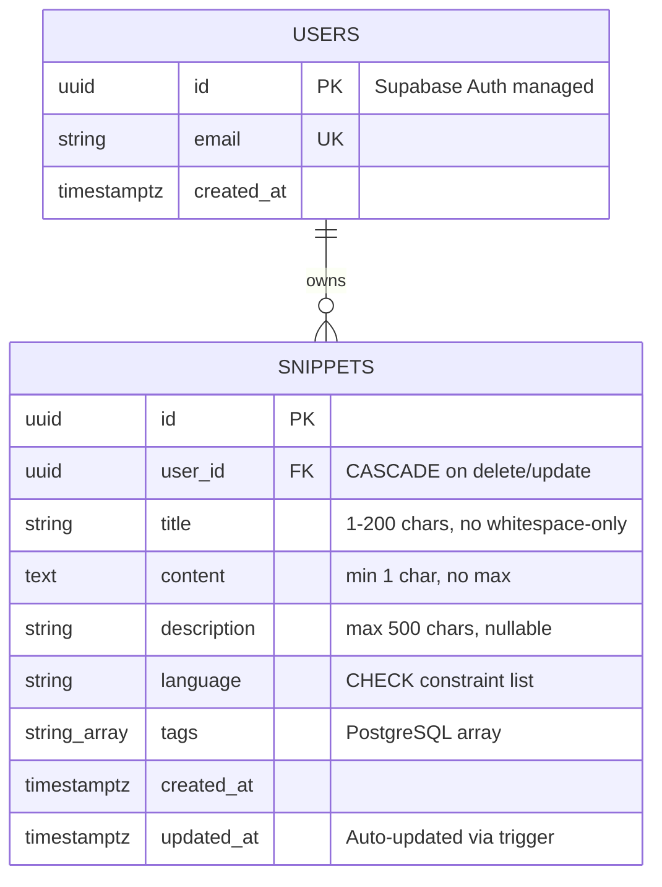

# Database Schema Plan - Spellbook MVP

## Overview

This document defines the complete PostgreSQL database schema for Spellbook MVP, a personal code snippet management application. The schema is designed for Supabase (PostgreSQL 15+) with Row Level Security (RLS) enabled.

**Project:** Spellbook MVP  
**Database:** PostgreSQL 15+ (Supabase managed)  
**Pattern:** Single table for snippets + Supabase Auth for users  
**Security:** Row Level Security (RLS) enforced at database level

---

## Tables

### 1. auth.users (Supabase Managed)

> [!NOTE]
> This table is automatically created and managed by Supabase Auth. Do not create or modify directly.

**Purpose:** User authentication and account management

**Key Columns:**

- `id` - UUID (Primary Key)
- `email` - TEXT (Unique)
- `encrypted_password` - TEXT (bcrypt hashed)
- `created_at` - TIMESTAMPTZ
- `updated_at` - TIMESTAMPTZ

**Management:**

- Automatic password hashing (bcrypt)
- JWT token generation
- Session management
- Email confirmation workflows

---

### 2. public.snippets

**Purpose:** Store code snippets, notes, and queries for authenticated users

| Column        | Type        | Constraints                                                                                                                                           | Description                                     |
| ------------- | ----------- | ----------------------------------------------------------------------------------------------------------------------------------------------------- | ----------------------------------------------- |
| `id`          | UUID        | PRIMARY KEY DEFAULT gen_random_uuid()                                                                                                                 | Unique snippet identifier                       |
| `user_id`     | UUID        | NOT NULL REFERENCES auth.users(id) ON DELETE CASCADE ON UPDATE CASCADE                                                                                | Owner of the snippet                            |
| `title`       | TEXT        | NOT NULL CHECK (char_length(title) >= 1 AND char_length(title) <= 200 AND trim(title) != '')                                                          | Snippet title (1-200 chars, no whitespace-only) |
| `content`     | TEXT        | NOT NULL CHECK (char_length(content) >= 1)                                                                                                            | Snippet code/text (min 1 char, no max)          |
| `description` | TEXT        | CHECK (description IS NULL OR char_length(description) <= 500)                                                                                        | Optional description (max 500 chars)            |
| `language`    | TEXT        | NOT NULL CHECK (language IN ('Bash', 'CSS', 'Elixir', 'HTML', 'JavaScript', 'JSON', 'MySQL', 'Note', 'Other', 'PHP', 'Python', 'TypeScript', 'YAML')) | Programming language/type                       |
| `tags`        | TEXT[]      | DEFAULT '{}'                                                                                                                                          | Array of tags for categorization                |
| `created_at`  | TIMESTAMPTZ | NOT NULL DEFAULT NOW()                                                                                                                                | Creation timestamp                              |
| `updated_at`  | TIMESTAMPTZ | NOT NULL DEFAULT NOW()                                                                                                                                | Last update timestamp (auto-updated)            |

**Notes:**

- `id` uses `gen_random_uuid()` (PostgreSQL 13+ built-in, no extension required)
- `user_id` cascades on DELETE and UPDATE for referential integrity
- `title` validates against whitespace-only strings
- `content` has no maximum length (TEXT supports up to 1GB)
- `language` is restricted to predefined list via CHECK constraint
- `tags` is PostgreSQL array type (simple MVP solution vs junction table)
- All timestamps are timezone-aware (TIMESTAMPTZ)

---

## Relationships

### Entity Relationship Diagram



### Relationship Details

**auth.users → public.snippets (1:N)**

- **Cardinality:** One user can have many snippets
- **Foreign Key:** `snippets.user_id` REFERENCES `auth.users(id)`
- **On Delete:** CASCADE - deleting user deletes all their snippets
- **On Update:** CASCADE - UUID update propagates (theoretical, UUIDs don't change)
- **Rationale:** Personal snippet manager - snippets belong to one user, orphaned snippets have no meaning

---

## Indexes

### Performance Strategy

Indexes are designed to optimize the primary access patterns:

1. Listing user's snippets sorted by newest first
2. Full-text search across title/description/content
3. Filtering by language
4. Filtering by tags

### Index Definitions

#### 1. Primary Key Index (Automatic)

```sql
-- Automatically created with PRIMARY KEY constraint
-- snippets_pkey ON snippets(id)
```

#### 2. User + Created Date Composite Index

```sql
CREATE INDEX idx_snippets_user_created
ON public.snippets(user_id, created_at DESC);
```

**Purpose:** Optimize main query pattern - list user's snippets newest first  
**Query:** `SELECT * FROM snippets WHERE user_id = ? ORDER BY created_at DESC`  
**Impact:** Critical for performance, used on every page load

#### 3. User ID Index

```sql
CREATE INDEX idx_snippets_user_id
ON public.snippets(user_id);
```

**Purpose:** Support RLS filtering and user-specific queries  
**Query:** Used by RLS policies and filtered queries  
**Impact:** Essential for security and multi-user scalability

#### 4. Language Index

```sql
CREATE INDEX idx_snippets_language
ON public.snippets(language);
```

**Purpose:** Fast filtering by programming language  
**Query:** `WHERE language = 'JavaScript'`  
**Impact:** Moderate - used when language filter is active

#### 5. Tags GIN Index

```sql
CREATE INDEX idx_snippets_tags
ON public.snippets USING gin(tags);
```

**Purpose:** Efficient array containment queries  
**Query:** `WHERE 'api' = ANY(tags)` or `WHERE tags @> ARRAY['api']`  
**Impact:** Critical for tag-based filtering  
**Type:** GIN (Generalized Inverted Index) optimized for array operations

#### 6. Full-Text Search GIN Index

```sql
CREATE INDEX idx_snippets_search
ON public.snippets
USING gin(to_tsvector('english', title || ' ' || COALESCE(description, '') || ' ' || content));
```

**Purpose:** Fast full-text search across multiple fields  
**Query:** `WHERE to_tsvector('english', title || ...) @@ to_tsquery('english', ?)`  
**Impact:** Critical for search functionality  
**Features:**

- Searches across: title + description + content
- Uses English dictionary for stemming
- COALESCE handles NULL descriptions
- GIN index for fast text search

**Alternative (Optional Enhancement):**

```sql
-- Weighted search (title > description > content)
CREATE INDEX idx_snippets_weighted_search
ON public.snippets
USING gin(
  setweight(to_tsvector('english', title), 'A') ||
  setweight(to_tsvector('english', COALESCE(description, '')), 'B') ||
  setweight(to_tsvector('english', content), 'C')
);
```

**Notes:** Provides better relevance ranking but adds complexity. Recommended for v2 if needed.

### Index Summary

| Index Name                | Type   | Columns                    | Size Impact | Query Impact         |
| ------------------------- | ------ | -------------------------- | ----------- | -------------------- |
| snippets_pkey             | B-tree | (id)                       | Small       | High (PK lookups)    |
| idx_snippets_user_created | B-tree | (user_id, created_at DESC) | Medium      | Critical (main list) |
| idx_snippets_user_id      | B-tree | (user_id)                  | Small       | High (RLS)           |
| idx_snippets_language     | B-tree | (language)                 | Small       | Medium (filters)     |
| idx_snippets_tags         | GIN    | (tags)                     | Medium      | High (tag search)    |
| idx_snippets_search       | GIN    | (tsvector expression)      | Large       | Critical (search)    |

**Total Storage Overhead:** ~15-25% for <200 snippets (acceptable trade-off)

---

## Triggers

### Auto-Update Timestamp Trigger

**Purpose:** Automatically update `updated_at` column on every UPDATE operation

#### Function Definition

```sql
CREATE OR REPLACE FUNCTION update_updated_at_column()
RETURNS TRIGGER AS $$
BEGIN
    NEW.updated_at = NOW();
    RETURN NEW;
END;
$$ LANGUAGE 'plpgsql';
```

#### Trigger Definition

```sql
CREATE TRIGGER update_snippets_updated_at
BEFORE UPDATE ON public.snippets
FOR EACH ROW
EXECUTE FUNCTION update_updated_at_column();
```

**Behavior:**

- Fires BEFORE each UPDATE on snippets table
- Sets `updated_at` to current timestamp
- Runs for every row being updated
- User cannot override this value (security feature)

**Rationale:**

- Eliminates manual timestamp management in application code
- Ensures accurate "last modified" tracking
- BEFORE trigger allows modification of NEW record

---

## Row Level Security (RLS) Policies

### Security Architecture

Row Level Security enforces data isolation at the PostgreSQL level, ensuring users can only access their own snippets. This is **impossible to bypass** from the application layer.

### Enable RLS

```sql
ALTER TABLE public.snippets ENABLE ROW LEVEL SECURITY;
```

### Policy 1: SELECT (Read)

```sql
CREATE POLICY "Users can view their own snippets"
ON public.snippets
FOR SELECT
USING (auth.uid() = user_id);
```

**Effect:** Users can only SELECT snippets where `user_id` matches their authenticated user ID  
**Function:** `auth.uid()` extracts user ID from JWT token  
**Type:** Permissive (default)

### Policy 2: INSERT (Create)

```sql
CREATE POLICY "Users can insert their own snippets"
ON public.snippets
FOR INSERT
WITH CHECK (auth.uid() = user_id);
```

**Effect:** Users can only INSERT snippets with their own `user_id`  
**Validation:** WITH CHECK verifies `user_id` in NEW row matches authenticated user  
**Security:** Prevents users from creating snippets "owned" by other users

### Policy 3: UPDATE (Modify)

```sql
CREATE POLICY "Users can update their own snippets"
ON public.snippets
FOR UPDATE
USING (auth.uid() = user_id)
WITH CHECK (auth.uid() = user_id);
```

**Effect:** Users can only UPDATE snippets they own, and cannot change ownership  
**USING:** Row must belong to user (filters existing rows)  
**WITH CHECK:** Modified row must still belong to user (validates changes)  
**Security:** Prevents both unauthorized edits and ownership transfer

### Policy 4: DELETE (Remove)

```sql
CREATE POLICY "Users can delete their own snippets"
ON public.snippets
FOR DELETE
USING (auth.uid() = user_id);
```

**Effect:** Users can only DELETE snippets where `user_id` matches their ID  
**Security:** Prevents deleting other users' data

### RLS Policy Summary

| Operation | Policy Name                         | Condition                     | Purpose                       |
| --------- | ----------------------------------- | ----------------------------- | ----------------------------- |
| SELECT    | Users can view their own snippets   | `auth.uid() = user_id`        | Read isolation                |
| INSERT    | Users can insert their own snippets | `auth.uid() = user_id`        | Write authorization           |
| UPDATE    | Users can update their own snippets | `auth.uid() = user_id` (both) | Modify + ownership protection |
| DELETE    | Users can delete their own snippets | `auth.uid() = user_id`        | Delete authorization          |

**Security Benefits:**

- ✅ Database-enforced (cannot be bypassed from app)
- ✅ No application-level filtering needed
- ✅ Automatic `user_id` validation
- ✅ Works with Supabase SDK automatically
- ✅ Protects against SQL injection attacks
- ✅ Multi-tenant ready (if needed in future)

**Anonymous Users:**

- No special handling needed
- Frontend middleware redirects to `/login` before database access
- RLS policies assume `auth.uid()` always exists for protected routes

---

## Data Validation Strategy

### Multi-Layer Validation

The schema implements defense-in-depth with three validation layers:

#### 1. Database Level (PostgreSQL Constraints)

```sql
-- Ultimate enforcement - cannot be bypassed
title TEXT NOT NULL
  CHECK (char_length(title) >= 1 AND char_length(title) <= 200 AND trim(title) != '')

content TEXT NOT NULL
  CHECK (char_length(content) >= 1)

description TEXT
  CHECK (description IS NULL OR char_length(description) <= 500)

language TEXT NOT NULL
  CHECK (language IN ('Bash', 'CSS', 'Elixir', 'HTML', 'JavaScript',
                      'JSON', 'MySQL', 'Note', 'Other', 'PHP',
                      'Python', 'TypeScript', 'YAML'))
```

#### 2. Application Level (Zod Schemas)

```typescript
// Frontend validation for UX
const snippetSchema = z.object({
  title: z.string().min(1).max(200).refine(s => s.trim().length > 0),
  content: z.string().min(1),
  description: z.string().max(500).optional(),
  language: z.enum(['Bash', 'CSS', 'Elixir', ...]),
  tags: z.array(z.string()).default([])
})
```

#### 3. RLS Policies

```sql
-- Authorization validation
WITH CHECK (auth.uid() = user_id)
```

### Validation Rules Reference

| Field       | Required | Min    | Max       | Additional Rules                 |
| ----------- | -------- | ------ | --------- | -------------------------------- |
| title       | ✅       | 1 char | 200 chars | No whitespace-only               |
| content     | ✅       | 1 char | No limit  | -                                |
| description | ❌       | -      | 500 chars | Nullable                         |
| language    | ✅       | -      | -         | Predefined list (13 values)      |
| tags        | ❌       | -      | No limit  | Array, reasonable usage expected |
| user_id     | ✅       | -      | -         | Must match auth.uid()            |

---

## Migration Script

### Complete SQL Migration

```sql
-- ============================================================================
-- Spellbook MVP - Database Migration
-- PostgreSQL 15+ (Supabase)
-- ============================================================================

-- Note: auth.users table is automatically managed by Supabase Auth
-- Do not create or modify auth.users

-- ----------------------------------------------------------------------------
-- Table: public.snippets
-- ----------------------------------------------------------------------------

CREATE TABLE public.snippets (
  -- Primary key
  id UUID PRIMARY KEY DEFAULT gen_random_uuid(),

  -- Foreign key to auth.users (Supabase Auth)
  user_id UUID NOT NULL
    REFERENCES auth.users(id)
    ON DELETE CASCADE
    ON UPDATE CASCADE,

  -- Snippet data
  title TEXT NOT NULL
    CHECK (
      char_length(title) >= 1
      AND char_length(title) <= 200
      AND trim(title) != ''
    ),

  content TEXT NOT NULL
    CHECK (char_length(content) >= 1),

  description TEXT
    CHECK (description IS NULL OR char_length(description) <= 500),

  language TEXT NOT NULL
    CHECK (language IN (
      'Bash',
      'CSS',
      'Elixir',
      'HTML',
      'JavaScript',
      'JSON',
      'MySQL',
      'Note',
      'Other',
      'PHP',
      'Python',
      'TypeScript',
      'YAML'
    )),

  tags TEXT[] DEFAULT '{}',

  -- Timestamps (timezone-aware)
  created_at TIMESTAMPTZ NOT NULL DEFAULT NOW(),
  updated_at TIMESTAMPTZ NOT NULL DEFAULT NOW()
);

-- ----------------------------------------------------------------------------
-- Indexes for Performance
-- ----------------------------------------------------------------------------

-- Composite index for main query pattern (user's snippets, newest first)
CREATE INDEX idx_snippets_user_created
ON public.snippets(user_id, created_at DESC);

-- Single-column indexes
CREATE INDEX idx_snippets_user_id
ON public.snippets(user_id);

CREATE INDEX idx_snippets_language
ON public.snippets(language);

-- GIN index for array operations (tags)
CREATE INDEX idx_snippets_tags
ON public.snippets USING gin(tags);

-- GIN index for full-text search
CREATE INDEX idx_snippets_search
ON public.snippets
USING gin(
  to_tsvector('english',
    title || ' ' || COALESCE(description, '') || ' ' || content
  )
);

-- ----------------------------------------------------------------------------
-- Trigger Function: Auto-update updated_at
-- ----------------------------------------------------------------------------

CREATE OR REPLACE FUNCTION update_updated_at_column()
RETURNS TRIGGER AS $$
BEGIN
    NEW.updated_at = NOW();
    RETURN NEW;
END;
$$ LANGUAGE 'plpgsql';

-- ----------------------------------------------------------------------------
-- Trigger: Apply auto-update on snippets table
-- ----------------------------------------------------------------------------

CREATE TRIGGER update_snippets_updated_at
BEFORE UPDATE ON public.snippets
FOR EACH ROW
EXECUTE FUNCTION update_updated_at_column();

-- ----------------------------------------------------------------------------
-- Row Level Security (RLS)
-- ----------------------------------------------------------------------------

-- Enable RLS on snippets table
ALTER TABLE public.snippets ENABLE ROW LEVEL SECURITY;

-- Policy: Users can view their own snippets
CREATE POLICY "Users can view their own snippets"
ON public.snippets
FOR SELECT
USING (auth.uid() = user_id);

-- Policy: Users can insert their own snippets
CREATE POLICY "Users can insert their own snippets"
ON public.snippets
FOR INSERT
WITH CHECK (auth.uid() = user_id);

-- Policy: Users can update their own snippets
CREATE POLICY "Users can update their own snippets"
ON public.snippets
FOR UPDATE
USING (auth.uid() = user_id)
WITH CHECK (auth.uid() = user_id);

-- Policy: Users can delete their own snippets
CREATE POLICY "Users can delete their own snippets"
ON public.snippets
FOR DELETE
USING (auth.uid() = user_id);

-- ============================================================================
-- Migration Complete
-- ============================================================================

-- Verification queries (run manually to confirm):
--
-- SELECT * FROM pg_tables WHERE tablename = 'snippets';
-- SELECT * FROM pg_indexes WHERE tablename = 'snippets';
-- SELECT * FROM pg_policies WHERE tablename = 'snippets';
-- SELECT * FROM pg_trigger WHERE tgname = 'update_snippets_updated_at';
```

### Rollback Script

```sql
-- ============================================================================
-- Rollback Migration - Spellbook MVP
-- ============================================================================

-- Drop RLS policies
DROP POLICY IF EXISTS "Users can delete their own snippets" ON public.snippets;
DROP POLICY IF EXISTS "Users can update their own snippets" ON public.snippets;
DROP POLICY IF EXISTS "Users can insert their own snippets" ON public.snippets;
DROP POLICY IF EXISTS "Users can view their own snippets" ON public.snippets;

-- Drop trigger
DROP TRIGGER IF EXISTS update_snippets_updated_at ON public.snippets;

-- Drop function
DROP FUNCTION IF EXISTS update_updated_at_column();

-- Drop table (CASCADE removes indexes automatically)
DROP TABLE IF EXISTS public.snippets CASCADE;

-- Note: auth.users is managed by Supabase and should NOT be dropped
```

---

## Design Decisions & Rationale

### 1. Single Table Architecture

**Decision:** Use one `snippets` table instead of multiple normalized tables

**Rationale:**

- Simple MVP scope - snippets are the only core entity
- No complex joins needed
- Easier to query and maintain
- Faster development (~4-6 hours saved vs multi-table design)
- Personal use case with ~200 snippets - no scaling concerns

**Trade-offs:**

- ✅ Simplicity, performance, faster development
- ❌ Less flexible for future features (acceptable for MVP)

### 2. Tags as Array vs Junction Table

**Decision:** Store tags as PostgreSQL `TEXT[]` array

**Rationale:**

- MVP doesn't require tag aggregation or autocomplete
- Simpler schema and queries
- GIN index provides good performance
- Saves ~4-6 hours of development time
- Easy to refactor to junction table in v2 if needed

**Trade-offs:**

- ✅ Simple, fast queries, no joins
- ❌ Can't easily find "most popular tags" (not an MVP requirement)

### 3. Language as TEXT with CHECK vs ENUM

**Decision:** Use `TEXT` with CHECK constraint

**Rationale:**

- Easier to add new languages (ALTER vs DROP/CREATE enum)
- Better Supabase SDK support
- Consistent with Zod validation in frontend
- More flexible for future expansion

**Trade-offs:**

- ✅ Flexibility, easier maintenance
- ❌ Slightly larger storage (insignificant for <200 rows)

### 4. No Soft Delete

**Decision:** Hard delete with CASCADE

**Rationale:**

- MVP scope - no "trash bin" or undo feature required
- Simpler implementation
- GDPR compliance easier (real deletion)
- Can add soft delete in v2 if needed

**Trade-offs:**

- ✅ Simpler code, true deletion
- ❌ No recovery after delete (acceptable - user confirms deletion)

### 5. No Audit Log / Versioning

**Decision:** No history tracking in MVP

**Rationale:**

- Explicitly out of MVP scope (PRD)
- Would add ~8-12 hours of development
- Would require additional tables and triggers
- Personal use case doesn't require audit trail

**Future Enhancement:**

- v2 could add `snippet_versions` table with trigger

### 6. No User Profiles Table

**Decision:** No `public.profiles` extending `auth.users`

**Rationale:**

- Current requirements only need email + password (in auth.users)
- No additional user fields needed for MVP (no avatar, display name, preferences)
- Premature optimization
- Easy to add in v2 when needed

### 7. Composite Index Strategy

**Decision:** Create `(user_id, created_at DESC)` composite index

**Rationale:**

- Optimizes most common query: user's snippets sorted by date
- PostgreSQL can use composite index efficiently
- Single-column indexes on user_id and created_at separately would be less efficient
- Critical for good performance even with <200 snippets

### 8. Full-Text Search Implementation

**Decision:** GIN index on expression vs dedicated tsvector column

**Rationale:**

- Simpler schema (no extra column)
- No trigger needed to maintain tsvector
- For <200 snippets, performance difference is negligible
- Saves development time and complexity

**Trade-offs:**

- ✅ Simpler, adequate performance
- ❌ Slightly slower than dedicated column (not noticeable at MVP scale)

### 9. Whitespace Validation in Database

**Decision:** Add `trim(title) != ''` to CHECK constraint

**Rationale:**

- Prevents title consisting only of spaces
- Database-level safeguard even if client validation is bypassed
- Improves data quality
- Minimal performance impact

### 10. Timezone-Aware Timestamps

**Decision:** Use TIMESTAMPTZ instead of TIMESTAMP

**Rationale:**

- Best practice for multi-timezone support
- Future-proofs for potential multi-user or deployed version
- Supabase recommendation
- No storage overhead vs TIMESTAMP

---

## Future Enhancements (v2+)

### Potential Schema Extensions

**Not in MVP - documented for future reference**

#### 1. Snippet Versioning

```sql
CREATE TABLE snippet_versions (
  id UUID PRIMARY KEY DEFAULT gen_random_uuid(),
  snippet_id UUID REFERENCES snippets(id) ON DELETE CASCADE,
  version_number INTEGER NOT NULL,
  title TEXT NOT NULL,
  content TEXT NOT NULL,
  created_at TIMESTAMPTZ NOT NULL DEFAULT NOW(),
  created_by UUID REFERENCES auth.users(id)
);
```

#### 2. User Profiles

```sql
CREATE TABLE public.profiles (
  id UUID PRIMARY KEY REFERENCES auth.users(id) ON DELETE CASCADE,
  display_name TEXT,
  avatar_url TEXT,
  preferences JSONB DEFAULT '{}',
  created_at TIMESTAMPTZ NOT NULL DEFAULT NOW(),
  updated_at TIMESTAMPTZ NOT NULL DEFAULT NOW()
);
```

#### 3. Tags Normalization (Many-to-Many)

```sql
CREATE TABLE tags (
  id UUID PRIMARY KEY DEFAULT gen_random_uuid(),
  name TEXT UNIQUE NOT NULL,
  usage_count INTEGER DEFAULT 0
);

CREATE TABLE snippet_tags (
  snippet_id UUID REFERENCES snippets(id) ON DELETE CASCADE,
  tag_id UUID REFERENCES tags(id) ON DELETE CASCADE,
  PRIMARY KEY (snippet_id, tag_id)
);
```

#### 4. Snippet Sharing

```sql
CREATE TABLE snippet_shares (
  id UUID PRIMARY KEY DEFAULT gen_random_uuid(),
  snippet_id UUID REFERENCES snippets(id) ON DELETE CASCADE,
  share_token UUID UNIQUE DEFAULT gen_random_uuid(),
  is_public BOOLEAN DEFAULT false,
  expires_at TIMESTAMPTZ,
  created_at TIMESTAMPTZ NOT NULL DEFAULT NOW()
);
```

#### 5. Favorites/Bookmarks

```sql
ALTER TABLE snippets ADD COLUMN is_favorite BOOLEAN DEFAULT false;
CREATE INDEX idx_snippets_favorites ON snippets(user_id, is_favorite)
  WHERE is_favorite = true;
```

---

## Performance Expectations

### Query Performance Targets (MVP)

Based on ~200 snippets per user on Supabase free tier:

| Operation                     | Target | Index Used                                   |
| ----------------------------- | ------ | -------------------------------------------- |
| List all snippets (paginated) | <50ms  | idx_snippets_user_created                    |
| Full-text search              | <100ms | idx_snippets_search                          |
| Filter by language            | <75ms  | idx_snippets_user_id + idx_snippets_language |
| Filter by tag                 | <75ms  | idx_snippets_tags (GIN)                      |
| Get single snippet            | <20ms  | Primary key                                  |
| Create snippet                | <100ms | -                                            |
| Update snippet                | <100ms | Trigger overhead minimal                     |
| Delete snippet                | <50ms  | -                                            |

### Scaling Considerations

**Current Design Supports:**

- Up to 1,000 snippets per user: excellent performance
- Up to 10,000 snippets per user: good performance
- Up to 100 users: excellent (RLS overhead minimal)

**Bottlenecks at Scale:**

- 10,000+ snippets: consider pagination, separate archive table
- 1,000+ users: consider connection pooling optimization (Supabase handles this)
- Large content fields (>10KB each): consider separate content table

**Optimization Opportunities (if needed):**

- Add partial indexes for common filters
- Implement materialized views for aggregations
- Add dedicated tsvector column for search
- Partition table by user_id (unlikely needed)

---

## Testing Checklist

### Schema Validation

- [ ] All tables created successfully
- [ ] All indexes created successfully
- [ ] All triggers created successfully
- [ ] RLS policies enabled and created
- [ ] Foreign key constraints working (CASCADE delete)
- [ ] CHECK constraints rejecting invalid data

### RLS Policy Testing

- [ ] User can SELECT only own snippets
- [ ] User cannot SELECT other users' snippets
- [ ] User can INSERT only with own user_id
- [ ] User cannot INSERT with different user_id
- [ ] User can UPDATE only own snippets
- [ ] User cannot UPDATE user_id field
- [ ] User can DELETE only own snippets
- [ ] User cannot DELETE other users' snippets

### Trigger Testing

- [ ] `updated_at` automatically updates on UPDATE
- [ ] `updated_at` does not change on INSERT
- [ ] `created_at` never changes after INSERT

### Index Performance Testing

- [ ] Main list query uses idx_snippets_user_created (EXPLAIN ANALYZE)
- [ ] Search query uses idx_snippets_search (EXPLAIN ANALYZE)
- [ ] Language filter uses appropriate indexes
- [ ] Tag filter uses idx_snippets_tags (GIN)

### Data Validation Testing

- [ ] Empty title rejected
- [ ] Whitespace-only title rejected
- [ ] Title >200 chars rejected
- [ ] Empty content rejected
- [ ] Description >500 chars rejected
- [ ] Invalid language rejected
- [ ] Valid data accepted

---

## Maintenance Notes

### Adding a New Language

```sql
-- 1. Update CHECK constraint
ALTER TABLE public.snippets
DROP CONSTRAINT IF EXISTS snippets_language_check;

ALTER TABLE public.snippets
ADD CONSTRAINT snippets_language_check
CHECK (language IN (
  'Bash', 'CSS', 'Elixir', 'HTML', 'JavaScript', 'JSON',
  'MySQL', 'Note', 'Other', 'PHP', 'Python', 'TypeScript', 'YAML',
  'NEW_LANGUAGE'  -- Add here
));

-- 2. Update Zod schema in frontend (src/lib/schemas.ts)
-- 3. Update language list in form component
```

### Monitoring & Maintenance

**Regular Tasks:**

- Monitor table size: `SELECT pg_size_pretty(pg_total_relation_size('public.snippets'));`
- Monitor index usage: `SELECT * FROM pg_stat_user_indexes WHERE relname = 'snippets';`
- Check slow queries: Review Supabase dashboard query stats
- Vacuum analyze (automatic in Supabase)

**Backup Strategy:**

- Supabase automatic backups (daily on paid plans)
- Manual export via Supabase dashboard
- Application-level export feature (v2)

---

## Document Metadata

**Version:** 1.0  
**Created:** 2025-11-26  
**Last Updated:** 2025-11-26  
**Status:** ✅ Ready for Implementation  
**Author:** Database Architect

**Related Documents:**

- [PRD](./prd.md) - Product Requirements Document
- [Tech Stack](./tech-stack.md) - Technology Decisions
- [Technical Architecture](../docs/tech-architecture.md) - System Architecture

**Change Log:**

- v1.0 (2025-11-26): Initial schema design based on planning session decisions
