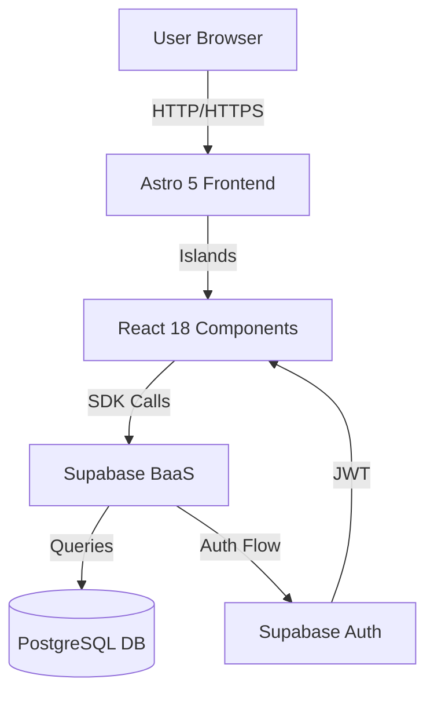
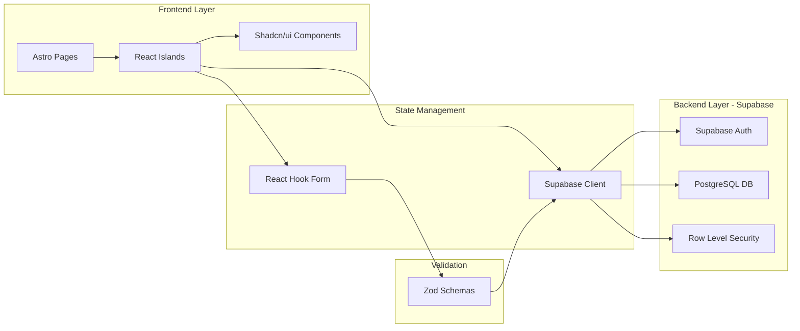
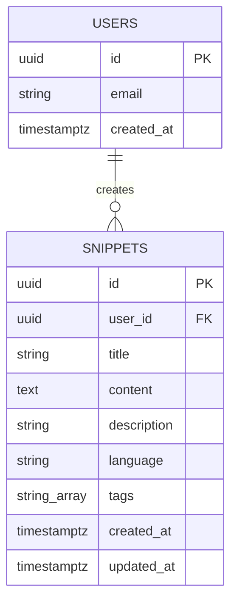
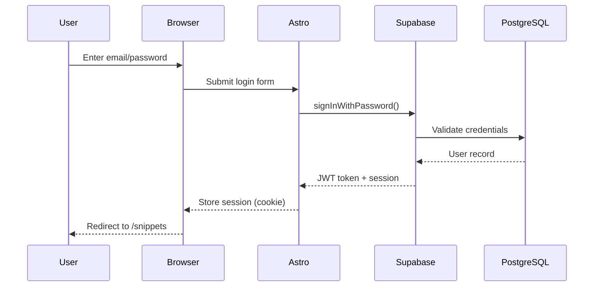
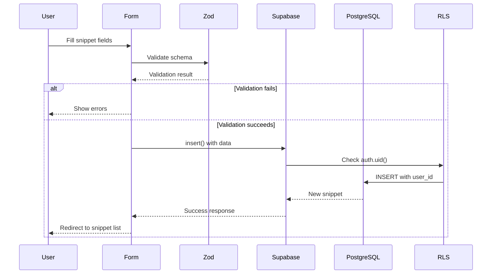
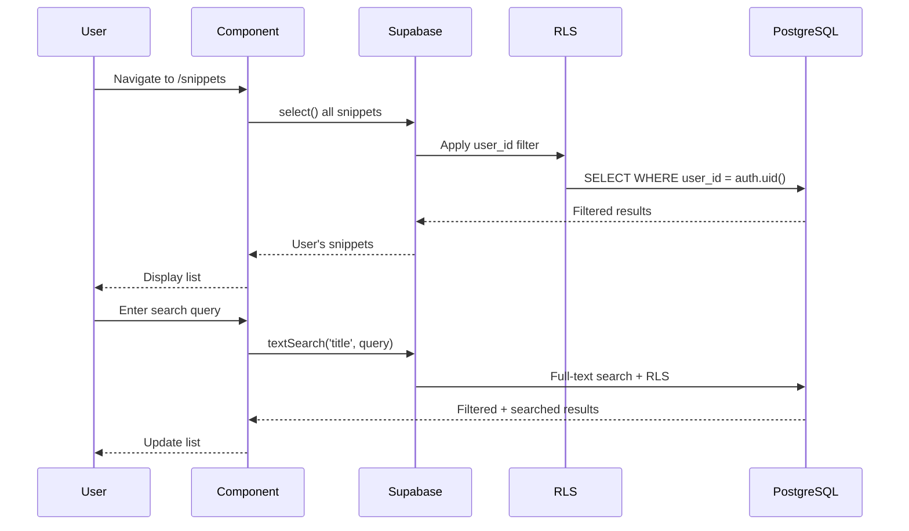
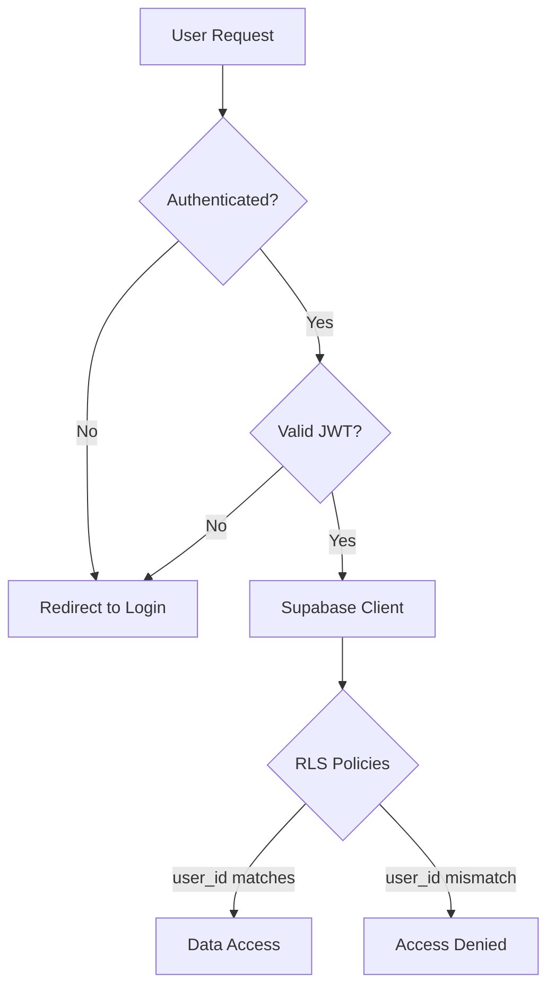
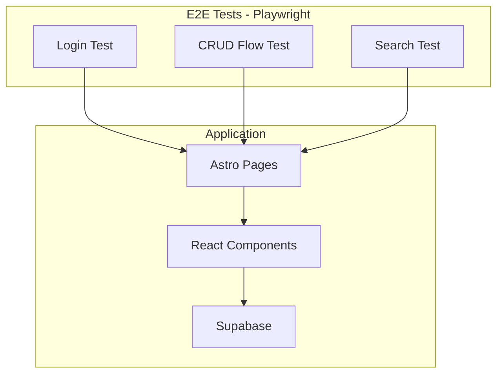
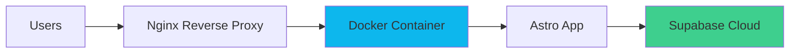

# Technical Architecture: Spellbook

## Overview

This document describes the technical architecture of Spellbook, a personal code snippet management application built with Astro 5, React 18, and Supabase.

**Project:** Spellbook MVP  
**Timeline:** 3 weeks (42 hours)  
**Architecture Type:** Monolithic Frontend + BaaS Backend  
**Deployment:** Local development only

---

## System Architecture

### High-Level Architecture



### Component Layers



---

## Technology Stack Details

### Frontend Stack

#### Astro 5

**Purpose:** Meta-framework and application shell  
**Responsibilities:**

- Page routing (`/`, `/login`, `/snippets`, `/snippets/:id`)
- SSR (Server-Side Rendering)
- Static asset optimization
- Development server

**Configuration:**

```typescript
// astro.config.mjs
export default defineConfig({
  output: "server", // SSR mode
  integrations: [react(), tailwind()],
  env: {
    schema: {
      PUBLIC_SUPABASE_URL: envField.string({ context: "client", access: "public" }),
      PUBLIC_SUPABASE_ANON_KEY: envField.string({ context: "client", access: "public" }),
    },
  },
});
```

---

#### React 18.3

**Purpose:** Interactive UI components  
**Usage Pattern:** Astro Islands (partial hydration)  
**Components:**

- Forms (Create/Edit snippet)
- Search bar
- Filter dropdowns
- Modals (Delete confirmation)
- Snippet list (interactive features)

**Hydration Strategy:**

```astro
<!-- Only hydrate interactive components -->
<SnippetForm client:load />
<SearchBar client:idle />
<SnippetList client:visible />

<!-- Static content stays static -->
<Header />
<Footer />
```

---

#### TypeScript 5

**Configuration Philosophy:** Liberal for learning, strict for production

```json
{
  "compilerOptions": {
    "target": "ES2022",
    "module": "ESNext",
    "lib": ["ES2022", "DOM"],
    "jsx": "react-jsx",
    "strict": false, // Liberal during MVP development
    "esModuleInterop": true,
    "skipLibCheck": true,
    "forceConsistentCasingInFileNames": true,
    "resolveJsonModule": true
  }
}
```

---

#### Tailwind CSS 3.x

**Purpose:** Utility-first styling  
**Key Features:**

- Responsive design utilities
- Custom color palette
- Component classes via `@layer`

**Configuration:**

```javascript
// tailwind.config.js
module.exports = {
  content: ['./src/**/*.{astro,html,js,jsx,ts,tsx}'],
  theme: {
    extend: {
      colors: {
        primary: {...},  // Custom brand colors
      },
    },
  },
  plugins: [],
}
```

---

### Backend Stack (Supabase BaaS)

#### Architecture Overview

```mermaid
graph TD
    App[Astro App]
    SDK[Supabase JS SDK]
    API[Supabase REST API]
    Auth[Supabase Auth Service]
    PG[(PostgreSQL)]
    RLS[Row Level Security]

    App -->|@supabase/supabase-js| SDK
    SDK -->|HTTP/REST| API
    API --> Auth
    API --> PG
    PG --> RLS
    RLS -->|Filter by user_id| PG
```

#### Supabase Components

**1. PostgreSQL Database**

- Managed PostgreSQL 15+
- Automatic backups
- Connection pooling
- Full-text search support

**2. Supabase Auth**

- Email/password authentication
- JWT session tokens
- Automatic user management
- `auth.users` table managed

**3. Row Level Security (RLS)**

- Database-level security
- Users can only access their own snippets
- Policies defined in SQL

**4. Supabase Client SDK**

- JavaScript/TypeScript client
- Automatic request signing
- Real-time subscriptions (optional)

---

## Database Design

### Entity Relationship Diagram



### Database Schema

```sql
-- Users table (managed by Supabase Auth)
-- Schema: auth.users
-- Automatically created and managed

-- Snippets table (PostgreSQL)
CREATE TABLE public.snippets (
  -- Primary key
  id UUID PRIMARY KEY DEFAULT gen_random_uuid(),

  -- Foreign key to auth.users
  user_id UUID NOT NULL REFERENCES auth.users(id) ON DELETE CASCADE,

  -- Snippet data
  title TEXT NOT NULL CHECK (char_length(title) >= 1 AND char_length(title) <= 200),
  content TEXT NOT NULL CHECK (char_length(content) >= 1),
  description TEXT,
  language TEXT NOT NULL,
  tags TEXT[] DEFAULT '{}',

  -- Timestamps
  created_at TIMESTAMPTZ NOT NULL DEFAULT NOW(),
  updated_at TIMESTAMPTZ NOT NULL DEFAULT NOW()
);

-- Indexes for performance
CREATE INDEX idx_snippets_user_id ON public.snippets(user_id);
CREATE INDEX idx_snippets_language ON public.snippets(language);
CREATE INDEX idx_snippets_created_at ON public.snippets(created_at DESC);

-- Full-text search index
CREATE INDEX idx_snippets_search ON public.snippets
USING gin(to_tsvector('english', title || ' ' || content));

-- Trigger to update updated_at
CREATE OR REPLACE FUNCTION update_updated_at_column()
RETURNS TRIGGER AS $$
BEGIN
    NEW.updated_at = NOW();
    RETURN NEW;
END;
$$ language 'plpgsql';

CREATE TRIGGER update_snippets_updated_at
BEFORE UPDATE ON public.snippets
FOR EACH ROW EXECUTE FUNCTION update_updated_at_column();
```

### Row Level Security (RLS) Policies

```sql
-- Enable RLS on snippets table
ALTER TABLE public.snippets ENABLE ROW LEVEL SECURITY;

-- Policy: Users can only SELECT their own snippets
CREATE POLICY "Users can view their own snippets"
ON public.snippets
FOR SELECT
USING (auth.uid() = user_id);

-- Policy: Users can only INSERT their own snippets
CREATE POLICY "Users can insert their own snippets"
ON public.snippets
FOR INSERT
WITH CHECK (auth.uid() = user_id);

-- Policy: Users can only UPDATE their own snippets
CREATE POLICY "Users can update their own snippets"
ON public.snippets
FOR UPDATE
USING (auth.uid() = user_id)
WITH CHECK (auth.uid() = user_id);

-- Policy: Users can only DELETE their own snippets
CREATE POLICY "Users can delete their own snippets"
ON public.snippets
FOR DELETE
USING (auth.uid() = user_id);
```

**Security Benefits:**

- Database-level access control
- No need for application-level filtering
- Impossible to bypass (enforced by PostgreSQL)
- Automatic user_id validation

---

## Data Flow

### Authentication Flow



### Create Snippet Flow



### Read Snippets Flow (with Search)



---

## Application Structure

### File Structure

```
spellbook/
├── .ai/
│   ├── prd.md                    # Product Requirements
│   └── tech-stack.md             # Tech stack decisions
│
├── docs/
│   ├── project-analysis.md       # Feasibility analysis
│   └── tech-architecture.md      # This document
│
├── src/
│   ├── components/
│   │   ├── ui/                   # Shadcn/ui components
│   │   │   ├── button.tsx
│   │   │   ├── input.tsx
│   │   │   ├── dialog.tsx
│   │   │   └── ...
│   │   │
│   │   ├── SnippetForm.tsx       # Create/Edit form
│   │   ├── SnippetList.tsx       # List of snippets
│   │   ├── SnippetCard.tsx       # Single snippet card
│   │   ├── SearchBar.tsx         # Search component
│   │   ├── FilterBar.tsx         # Language/tag filters
│   │   └── Header.tsx            # App header
│   │
│   ├── layouts/
│   │   ├── BaseLayout.astro      # Base HTML layout
│   │   └── AuthLayout.astro      # Layout with auth check
│   │
│   ├── pages/
│   │   ├── index.astro           # Homepage (redirect to /snippets)
│   │   ├── login.astro           # Login page
│   │   ├── snippets/
│   │   │   ├── index.astro       # Snippet list
│   │   │   ├── [id].astro        # Snippet detail
│   │   │   ├── new.astro         # Create snippet
│   │   │   └── [id]/edit.astro   # Edit snippet
│   │
│   ├── lib/
│   │   ├── supabase.ts           # Supabase client setup
│   │   ├── schemas.ts            # Zod validation schemas
│   │   └── types.ts              # TypeScript types
│   │
│   ├── middleware/
│   │   └── auth.ts               # Protected routes middleware
│   │
│   └── env.d.ts                  # Environment types
│
├── tests/
│   ├── e2e/
│   │   └── snippets.spec.ts      # E2E tests
│   └── playwright.config.ts
│
├── .github/
│   └── workflows/
│       └── ci.yml                # GitHub Actions CI/CD
│
├── .env.example                  # Example environment vars
├── astro.config.mjs              # Astro configuration
├── tailwind.config.js            # Tailwind configuration
├── tsconfig.json                 # TypeScript configuration
├── package.json
└── README.md
```

---

## Key Components

### Supabase Client Setup

```typescript
// src/lib/supabase.ts
import { createClient } from "@supabase/supabase-js";
import type { Database } from "./database.types";

const supabaseUrl = import.meta.env.PUBLIC_SUPABASE_URL;
const supabaseAnonKey = import.meta.env.PUBLIC_SUPABASE_ANON_KEY;

export const supabase = createClient<Database>(supabaseUrl, supabaseAnonKey, {
  auth: {
    autoRefreshToken: true,
    persistSession: true,
    detectSessionInUrl: true,
  },
});
```

### Validation Schemas

```typescript
// src/lib/schemas.ts
import { z } from "zod";

export const snippetSchema = z.object({
  title: z.string().min(1, "Title is required").max(200, "Title must be 200 characters or less"),

  content: z.string().min(1, "Content is required"),

  description: z.string().optional(),

  language: z.enum(["MySQL", "Bash", "PHP", "Elixir", "JavaScript", "Python", "TypeScript", "Other", "Note"]),

  tags: z.array(z.string()).default([]),
});

export type SnippetInput = z.infer<typeof snippetSchema>;
```

### Auth Middleware

```typescript
// src/middleware/auth.ts
import type { MiddlewareHandler } from "astro";
import { supabase } from "../lib/supabase";

export const requireAuth: MiddlewareHandler = async ({ request, redirect }, next) => {
  const {
    data: { session },
  } = await supabase.auth.getSession();

  if (!session) {
    return redirect("/login");
  }

  return next();
};
```

### Snippet Form Component

```tsx
// src/components/SnippetForm.tsx
import { useForm } from "react-hook-form";
import { zodResolver } from "@hookform/resolvers/zod";
import { snippetSchema, type SnippetInput } from "../lib/schemas";
import { supabase } from "../lib/supabase";

export function SnippetForm({ initialData, snippetId }) {
  const {
    register,
    handleSubmit,
    formState: { errors },
  } = useForm<SnippetInput>({
    resolver: zodResolver(snippetSchema),
    defaultValues: initialData,
  });

  const onSubmit = async (data: SnippetInput) => {
    if (snippetId) {
      // Update existing snippet
      const { error } = await supabase.from("snippets").update(data).eq("id", snippetId);
    } else {
      // Create new snippet
      const { error } = await supabase.from("snippets").insert(data);
    }

    if (!error) {
      window.location.href = "/snippets";
    }
  };

  return <form onSubmit={handleSubmit(onSubmit)}>{/* Form fields */}</form>;
}
```

---

## Security Architecture

### Security Layers



### Security Measures

**1. Authentication (Supabase Auth)**

- Email/password with bcrypt hashing
- JWT tokens (short-lived)
- HTTP-only cookies for session storage
- Automatic token refresh

**2. Authorization (Row Level Security)**

- Database-enforced policies
- ALL queries filtered by `auth.uid()`
- Impossible to access other users' data
- Policies apply to ALL database operations

**3. Input Validation**

- Client-side: Zod schemas + React Hook Form
- Server-side: PostgreSQL constraints
- XSS prevention: React auto-escaping
- SQL injection: Supabase SDK parameterized queries

**4. Environment Variables**

```bash
# .env (NEVER commit to Git)
PUBLIC_SUPABASE_URL=https://xxx.supabase.co
PUBLIC_SUPABASE_ANON_KEY=eyJ...  # Safe to expose (RLS protects data)
```

**5. HTTPS**

- Supabase always uses HTTPS
- Local dev: HTTP acceptable
- Production (if deployed): Enforced HTTPS

---

## Performance Considerations

### Frontend Optimization

**1. Astro Islands (Partial Hydration)**

```astro
<!-- Only interactive components get JS -->
<SnippetList client:visible />
<!-- Hydrate when visible -->
<SearchBar client:idle />
<!-- Hydrate when browser idle -->

<!-- Static components = zero JS -->
<Header />
<Footer />
```

**2. Code Splitting**

- Automatic by Astro
- Each page = separate bundle
- React components = separate chunks

**3. Image Optimization**

- Use Astro Image component (if images added later)
- Automatic responsive images
- WebP conversion

### Backend Optimization

**1. Database Indexes**

```sql
-- Already defined in schema
CREATE INDEX idx_snippets_user_id ON snippets(user_id);
CREATE INDEX idx_snippets_language ON snippets(language);
CREATE INDEX idx_snippets_created_at ON snippets(created_at DESC);
CREATE INDEX idx_snippets_search ON snippets USING gin(...);
```

**2. Query Optimization**

```typescript
// Only select needed columns
const { data } = await supabase
  .from("snippets")
  .select("id, title, language, created_at") // Not SELECT *
  .order("created_at", { ascending: false })
  .limit(50);
```

**3. Supabase Connection Pooling**

- Automatic connection pooling
- No manual pool management needed

### Caching Strategy (Optional, if time permits)

```typescript
// Browser-side caching with stale-while-revalidate
const fetchSnippets = async () => {
  const cached = sessionStorage.getItem("snippets");
  if (cached) {
    return JSON.parse(cached); // Show stale data immediately
  }

  const { data } = await supabase.from("snippets").select("*");
  sessionStorage.setItem("snippets", JSON.stringify(data));
  return data;
};
```

---

## Testing Strategy

### Test Architecture



### E2E Test Example

```typescript
// tests/e2e/snippets.spec.ts
import { test, expect } from "@playwright/test";

test("complete snippet lifecycle", async ({ page }) => {
  // 1. Login
  await page.goto("/login");
  await page.fill('[name="email"]', "test@example.com");
  await page.fill('[name="password"]', "password123");
  await page.click('button[type="submit"]');

  // 2. Create snippet
  await page.click("text=New Snippet");
  await page.fill('[name="title"]', "Test MySQL Query");
  await page.fill('[name="content"]', "SELECT * FROM users");
  await page.selectOption('[name="language"]', "MySQL");
  await page.click('button:has-text("Save")');

  // 3. Verify snippet appears
  await expect(page.locator("text=Test MySQL Query")).toBeVisible();

  // 4. Edit snippet
  await page.click("text=Test MySQL Query");
  await page.click("text=Edit");
  await page.fill('[name="title"]', "Updated MySQL Query");
  await page.click('button:has-text("Save")');

  // 5. Delete snippet
  await page.click("text=Delete");
  await page.click('button:has-text("Confirm")');

  // 6. Verify snippet deleted
  await expect(page.locator("text=Updated MySQL Query")).not.toBeVisible();
});
```

---

## CI/CD Pipeline

### GitHub Actions Workflow

```yaml
# .github/workflows/ci.yml
name: CI Pipeline

on:
  push:
    branches: [main, develop]
  pull_request:
    branches: [main]

jobs:
  build-and-test:
    runs-on: ubuntu-latest

    steps:
      - name: Checkout code
        uses: actions/checkout@v4

      - name: Setup Node.js
        uses: actions/setup-node@v4
        with:
          node-version: "20"
          cache: "npm"

      - name: Install dependencies
        run: npm ci

      - name: TypeScript type check
        run: npx tsc --noEmit

      - name: Build application
        run: npm run build
        env:
          PUBLIC_SUPABASE_URL: ${{ secrets.PUBLIC_SUPABASE_URL }}
          PUBLIC_SUPABASE_ANON_KEY: ${{ secrets.PUBLIC_SUPABASE_ANON_KEY }}

      - name: Install Playwright browsers
        run: npx playwright install --with-deps

      - name: Run E2E tests
        run: npm run test:e2e
        env:
          PUBLIC_SUPABASE_URL: ${{ secrets.PUBLIC_SUPABASE_URL }}
          PUBLIC_SUPABASE_ANON_KEY: ${{ secrets.PUBLIC_SUPABASE_ANON_KEY }}

      - name: Upload test results
        if: failure()
        uses: actions/upload-artifact@v4
        with:
          name: playwright-report
          path: playwright-report/
```

### Required GitHub Secrets

```
PUBLIC_SUPABASE_URL
PUBLIC_SUPABASE_ANON_KEY
```

---

## Deployment Architecture (Optional, Post-MVP)

### Future Deployment Options

**Option 1: Vercel (Recommended)**

```mermaid
graph LR
    User[Users] --> Vercel[Vercel Edge Network]
    Vercel --> Astro[Astro SSR]
    Astro --> Supabase[Supabase Cloud]

    style Vercel fill:#000
    style Supabase fill:#3ECF8E
```



**Cost:** $0 (Hobby tier sufficient)  
**Setup time:** 15 minutes  
**Benefits:** Automatic HTTPS, CDN, zero config

**Option 2: DigitalOcean + Docker (Learning)**



**Cost:** $6-12/month  
**Setup time:** 15-20 hours  
**Benefits:** Full control, learning DevOps

---

## Monitoring and Debugging

### Development Tools

**1. Supabase Dashboard**

- Database browser (view/edit data)
- Query logs
- Authentication logs
- Real-time subscriptions

**2. Browser DevTools**

- React DevTools (component inspection)
- Network tab (Supabase API calls)
- Console (error messages)

**3. Astro DevTools**

- `astro dev` - hot reload
- `astro check` - TypeScript errors
- Build analysis

### Error Handling

```typescript
// Centralized error handling
export async function withErrorHandling<T>(operation: () => Promise<T>): Promise<T | null> {
  try {
    return await operation();
  } catch (error) {
    if (error instanceof Error) {
      console.error("Operation failed:", error.message);
      // TODO: Add toast notification
    }
    return null;
  }
}

// Usage
const snippet = await withErrorHandling(async () => {
  const { data, error } = await supabase.from("snippets").select("*").eq("id", id).single();

  if (error) throw error;
  return data;
});
```

---

## Environment Configuration

### Environment Variables

```bash
# .env (Local development)
PUBLIC_SUPABASE_URL=https://xxxproject.supabase.co
PUBLIC_SUPABASE_ANON_KEY=eyJhbGci...

# Note: ANON_KEY is safe to expose (RLS protects data)
# Never commit this file to Git
```

### Environment Types

```typescript
// src/env.d.ts
/// <reference types="astro/client" />

interface ImportMetaEnv {
  readonly PUBLIC_SUPABASE_URL: string;
  readonly PUBLIC_SUPABASE_ANON_KEY: string;
}

interface ImportMeta {
  readonly env: ImportMetaEnv;
}
```

---

## Future Enhancements (Post-MVP)

### Potential Architecture Improvements

**1. Real-time Updates (Supabase Realtime)**

```typescript
// Subscribe to snippet changes
supabase
  .channel("snippets")
  .on("postgres_changes", { event: "*", schema: "public", table: "snippets" }, (payload) => {
    console.log("Change detected:", payload);
    // Update UI in real-time
  })
  .subscribe();
```

**2. Syntax Highlighting**

- Add Prism.js or Shiki
- Server-side rendering of code blocks
- +2-3 hours implementation

**3. AI Features (Openrouter.ai)**

- Auto-detect language
- Translate snippets between languages
- +5-10 hours implementation

**4. Export/Import**

- JSON export of all snippets
- Import from JSON
- +2-3 hours implementation

**5. API Endpoints (if needed)**

- Create custom Astro API routes
- Wrap Supabase calls
- Add custom business logic
- +4-6 hours implementation

---

## Appendix

### Useful Supabase Queries

```typescript
// Search with multiple filters
const { data } = await supabase
  .from("snippets")
  .select("*")
  .textSearch("content", searchQuery)
  .eq("language", "MySQL")
  .order("created_at", { ascending: false })
  .limit(20);

// Count snippets by language
const { count } = await supabase.from("snippets").select("*", { count: "exact", head: true }).eq("language", "MySQL");

// Batch delete
const { data } = await supabase.from("snippets").delete().in("id", [id1, id2, id3]);
```

### TypeScript Database Types

```typescript
// Generate types from Supabase schema
// Run: npx supabase gen types typescript --project-id xxx > src/lib/database.types.ts

export type Database = {
  public: {
    Tables: {
      snippets: {
        Row: {
          id: string;
          user_id: string;
          title: string;
          content: string;
          description: string | null;
          language: string;
          tags: string[];
          created_at: string;
          updated_at: string;
        };
        Insert: {
          id?: string;
          user_id?: string;
          title: string;
          content: string;
          description?: string | null;
          language: string;
          tags?: string[];
          created_at?: string;
          updated_at?: string;
        };
        Update: {
          id?: string;
          user_id?: string;
          title?: string;
          content?: string;
          description?: string | null;
          language?: string;
          tags?: string[];
          created_at?: string;
          updated_at?: string;
        };
      };
    };
  };
};
```

---

## References

- [Astro Documentation](https://docs.astro.build)
- [Supabase Documentation](https://supabase.com/docs)
- [Supabase Auth Guide](https://supabase.com/docs/guides/auth)
- [Supabase Database Guide](https://supabase.com/docs/guides/database)
- [PostgreSQL Full-Text Search](https://www.postgresql.org/docs/current/textsearch.html)
- [Row Level Security](https://supabase.com/docs/guides/auth/row-level-security)
- [React Hook Form](https://react-hook-form.com/)
- [Zod Documentation](https://zod.dev/)
- [Playwright Documentation](https://playwright.dev/)

---

**Document Version:** 1.0  
**Created:** 2025-11-24  
**Status:** ✅ Approved - Reference for implementation
